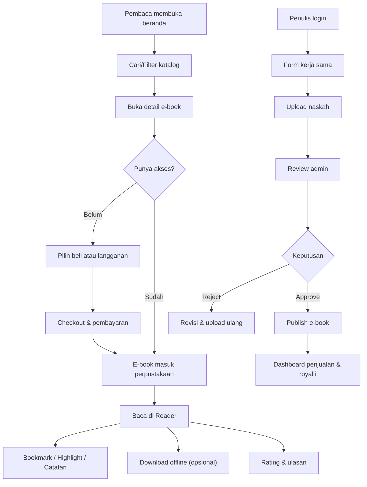

## 1. Gambaran Produk
Naraloka adalah platform e-book berbasis kerja sama penulis dengan pengalaman membaca modern, clean, dan minimalis (nuansa seperti Gramedia Digital dan Kindle).
- Tujuan: memudahkan pembaca menemukan, membeli/berlangganan, dan membaca e-book; memudahkan penulis mengajukan kerja sama, mengunggah naskah, serta memantau penjualan & royalti.
- Nilai: katalog terkurasi, rekomendasi berbasis minat, alat baca (bookmark, highlight, catatan), dan skema bagi hasil yang transparan.

## 2. Fitur Inti

### 2.1 Peran Pengguna
| Peran | Metode Registrasi | Hak Akses Inti |
|------|--------------------|----------------|
| Pembaca | Email / Google Login | Menelusuri katalog, membeli/berlangganan, membaca, ulasan, perpustakaan, wishlist |
| Penulis | Email / Google Login | Mengajukan kerja sama, upload naskah, melihat dashboard penjualan/royalti, statistik pembaca, transaksi |
| Admin | Undangan/akun internal | Manajemen pengguna/penulis/katalog, persetujuan naskah, set komisi & royalti, monitoring transaksi, analitik |

### 2.2 Modul Fitur
1. **Beranda**: hero/banner promo, kategori, unggulan, best seller, penulis populer, testimoni, paket, artikel/rekomendasi terbaru.
2. **Katalog & Pencarian**: pencarian, filter kategori, sort (terbaru/terlaris/rating), rekomendasi berbasis minat.
3. **Detail E-book**: cover HD, deskripsi lengkap, profil penulis, rating & ulasan, preview halaman, CTA beli/tambah perpustakaan, rekomendasi serupa.
4. **Pembaca (Reader)**: mode membaca, pagination, bookmark, highlight, catatan, daftar isi (opsional), progress baca, mode offline (download).
5. **Akun & Perpustakaan**: koleksi dibeli/diunduh, status langganan, wishlist, riwayat transaksi, notifikasi promo & rilis terbaru.
6. **Portal Penulis**: form pengajuan kerja sama, upload naskah, dashboard penjualan, dashboard royalti, statistik pembaca, riwayat transaksi.
7. **Admin Dashboard**: manajemen pengguna, manajemen penulis, manajemen katalog, persetujuan naskah, pengaturan komisi & royalti, monitoring transaksi, laporan & analisis performa.
8. **Integrasi**: Google Login, WhatsApp CS, email notifikasi, payment gateway (Midtrans/Xendit), Google Analytics, social sharing.

### 2.3 Rincian Halaman
| Nama Halaman | Nama Modul | Deskripsi Fitur |
|---|---|---|
| Beranda | Hero/Banner | Banner promo dengan CTA, rotasi otomatis dan kontrol manual, highlight benefit membership |
| Beranda | Kategori | Kartu kategori: Novel, Edukasi, Motivasi, Cerpen, Komik Digital + tautan ke katalog terfilter |
| Beranda | Unggulan | Slider/grid e-book unggulan dengan rating, label (Eksklusif/Promo) |
| Beranda | Best Seller | Daftar terlaris dengan nomor urut, metrik ringkas (rating, jumlah pembaca) |
| Beranda | Penulis Populer | Kartu penulis, tautan ke profil penulis dan karya |
| Beranda | Testimoni | Carousel testimoni pembaca dengan rating |
| Beranda | Paket | Perbandingan Gratis/Premium/Edukasi, harga, benefit, CTA langganan |
| Beranda | Artikel | Feed artikel/rekomendasi terbaru, tag kategori, tautan detail artikel |
| Katalog | Search Bar | Pencarian judul/penulis, suggestion, recent searches (opsional) |
| Katalog | Filter & Sort | Filter kategori, harga (gratis/berbayar), rating, format; sort terbaru/terlaris/rating |
| Katalog | Grid Listing | Card e-book: cover, judul, penulis, rating, harga/label membership |
| Detail E-book | Cover HD | Cover resolusi tinggi, zoom/expand, badge (Best Seller/Baru/Promo) |
| Detail E-book | Informasi Buku | Deskripsi lengkap, metadata (kategori, halaman, bahasa), sinopsis, highlight quote (opsional) |
| Detail E-book | Profil Penulis | Mini bio, tombol ikuti penulis, daftar buku penulis |
| Detail E-book | Rating & Ulasan | Rata-rata rating, distribusi bintang, daftar ulasan, tulis ulasan (setelah baca/beli) |
| Detail E-book | Preview Halaman | Preview beberapa halaman (read-only), CTA untuk lanjut beli/langganan |
| Detail E-book | CTA | Tombol Beli Sekarang, Tambah ke Perpustakaan, Tambah ke Wishlist |
| Detail E-book | Rekomendasi Serupa | Rekomendasi berdasarkan kategori & minat |
| Reader | Kanvas Membaca | Pagination, ukuran font, tema (light/sepia/night), progress dan estimasi waktu baca (opsional) |
| Reader | Bookmark | Tambah/kelola bookmark per halaman |
| Reader | Highlight & Catatan | Sorot teks (simulasi di web), catatan per highlight, daftar catatan |
| Reader | Offline Download | Unduh e-book untuk akses offline (indikator status, manajemen storage) |
| Perpustakaan | Koleksi | Tab Dibeli/Diunduh, pencarian lokal, sort terakhir dibaca |
| Wishlist | Daftar Wishlist | Tambah/hapus, notifikasi diskon (opsional) |
| Checkout/Paywall | Pilih Metode Bayar | QRIS, Transfer Bank, E-Wallet, VA, Kartu; status pembayaran & instruksi |
| Langganan | Paket & Auto Renewal | Aktivasi paket, toggle auto-renewal, riwayat tagihan |
| Portal Penulis | Pengajuan Kerja Sama | Form profil penulis, portofolio, pernyataan lisensi, persetujuan syarat |
| Portal Penulis | Upload Naskah | Upload file + metadata, validasi format, status review (draft/submitted/approved/rejected) |
| Portal Penulis | Dashboard Penjualan | Ringkasan penjualan, grafik, top books, filter tanggal |
| Portal Penulis | Dashboard Royalti | Estimasi royalti, komisi platform, status payout |
| Portal Penulis | Statistik Pembaca | Pembaca per hari, completion rate, rating tren |
| Portal Penulis | Riwayat Transaksi | Daftar transaksi terkait karya, export (opsional) |
| Admin | Manajemen Katalog | CRUD e-book, unggah cover, atur kategori, label, harga, akses membership |
| Admin | Persetujuan Naskah | Review naskah, komentar internal, keputusan approve/reject, publish schedule |
| Admin | Komisi & Royalti | Konfigurasi skema bagi hasil, rules per kategori/penulis (opsional) |
| Admin | Monitoring Transaksi | Status pembayaran, refund/cancel (opsional), audit log |
| Admin | Laporan & Analitik | KPI, performa buku/penulis, cohort membership, export |

## 3. Proses Utama
### 3.1 Alur Pembaca
1. Pengguna membuka beranda → eksplor kategori/unggulan/terlaris → masuk katalog.
2. Pengguna membuka detail e-book → membaca preview → memutuskan beli/langganan.
3. Pengguna melakukan checkout dengan metode pembayaran → status sukses → e-book masuk perpustakaan.
4. Pengguna membuka Reader → membaca → membuat bookmark/highlight/catatan → (opsional) mengunduh untuk offline.
5. Setelah membaca, pengguna memberi rating & ulasan → rekomendasi lebih akurat.

### 3.2 Alur Penulis
1. Penulis login → mengisi form kerja sama → upload naskah dan metadata.
2. Admin meninjau → approve/reject → jika approve, e-book dipublikasikan.
3. Penulis memantau penjualan, statistik pembaca, dan estimasi royalti → melihat riwayat transaksi/payout.

## 4. Desain Antarmuka
### 4.1 Gaya Desain
- Warna utama: putih (background), biru tua (aksi/brand), abu-abu (teks sekunder/border).
- Estetika: clean, minimalis, whitespace luas, fokus konten dan keterbacaan.
- Komponen: card halus, border tipis, shadow lembut, radius medium, states hover yang subtil.
- Tipografi: pasangan font display elegan untuk judul + body yang sangat terbaca untuk konten panjang.
- Ikon: garis tipis (outline), konsisten, tanpa dekorasi berlebihan.
- Motion: micro-interaction halus (hover/press), transisi pendek, skeleton/loading yang ringan.

### 4.2 Ringkasan Desain per Halaman
| Nama Halaman | Nama Modul | Elemen UI |
|---|---|---|
| Beranda | Hero | Layout lebar, headline kuat, CTA primary/secondary, gradient halus bernuansa biru tua |
| Beranda | Kategori | Grid 2–6 kolom responsif, ikon sederhana, fokus keterbacaan |
| Katalog | Filter | Panel filter yang bisa collapse di mobile, chip filter aktif, clear all |
| Detail E-book | CTA | Tombol primary “Beli Sekarang” + secondary “Tambah ke Perpustakaan”, sticky CTA di mobile |
| Reader | Kanvas | Kolom membaca nyaman, kontrol reader minimal, mode tema, progress bar halus |
| Portal Penulis | Dashboard | Kartu KPI, grafik garis/bar, tabel transaksi, filter periode |
| Admin | Analitik | Layout dashboard konsisten, tabel dengan sorting/pagination, badge status |

### 4.3 Responsif
- Desktop-first dengan breakpoint tablet & mobile.
- Navigasi: topbar dengan search; di mobile menjadi bottom nav untuk akses cepat (Beranda, Katalog, Perpustakaan, Akun).
- Komponen berat (chart/preview): lazy-load, placeholder skeleton.
- Reader: gesture-friendly (tap zone untuk next/prev, ukuran font, mode malam).
