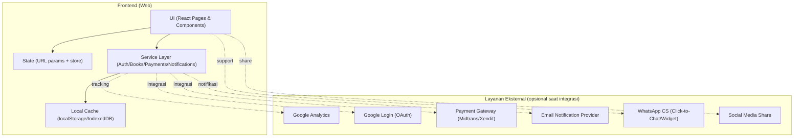
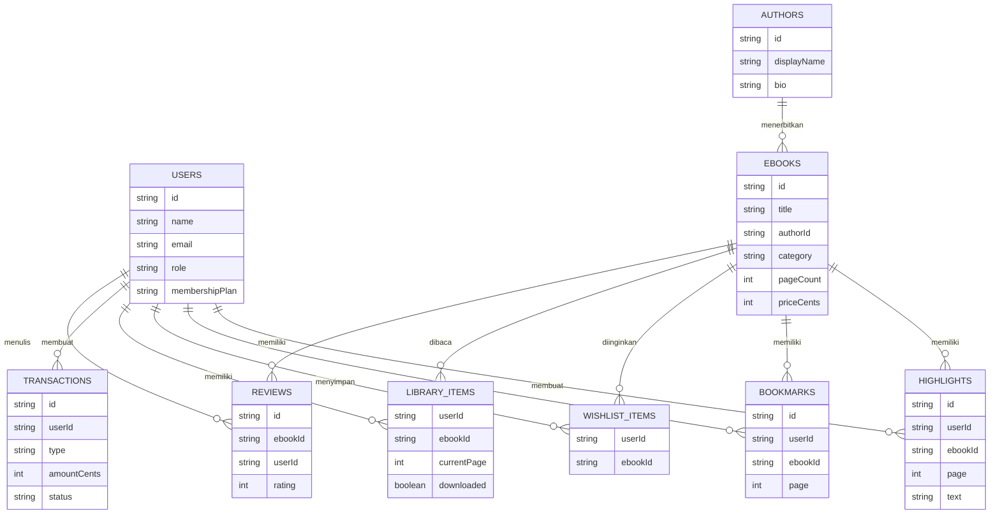

## 1. Desain Arsitektur
MVP difokuskan sebagai prototipe web (frontend) dengan data mock dan lapisan service yang siap diganti ke backend nyata saat integrasi payment/auth/analytics diaktifkan.



## 2. Deskripsi Teknologi
- Frontend: React@18 + TypeScript + Vite
- Styling: Tailwind CSS (token warna via CSS variables)
- Routing: React Router
- Data: mock data JSON + penyimpanan lokal (localStorage/IndexedDB) untuk perpustakaan, bookmark, highlight, catatan
- Visualisasi dashboard: library chart ringan (diputuskan saat implementasi berdasarkan ketersediaan dependensi)
- Integrasi eksternal (fase lanjutan): Google OAuth, Midtrans/Xendit, email, WhatsApp widget, Google Analytics

## 3. Definisi Rute
| Rute | Tujuan |
|---|---|
| / | Beranda |
| /katalog | Katalog + pencarian + filter |
| /ebook/:ebookId | Detail e-book |
| /baca/:ebookId | Reader (membaca) |
| /perpustakaan | Koleksi pengguna (dibeli/diunduh) |
| /wishlist | Wishlist pengguna |
| /langganan | Paket membership + status + auto renewal |
| /checkout | Checkout pembayaran (simulasi) |
| /login | Login (email/Google) |
| /penulis | Landing portal penulis |
| /penulis/ajukan | Form pengajuan kerja sama |
| /penulis/upload | Upload naskah |
| /penulis/dashboard | Dashboard penjualan/royalti/statistik/riwayat transaksi |
| /admin | Dashboard admin |
| /admin/katalog | Manajemen katalog e-book |
| /admin/naskah | Persetujuan naskah |
| /admin/penulis | Manajemen penulis |
| /admin/pengguna | Manajemen pengguna |
| /admin/transaksi | Monitoring transaksi |
| /admin/laporan | Laporan & analitik |

## 4. Definisi API (untuk integrasi backend di masa depan)
Pada MVP, modul di bawah diimplementasikan sebagai service lokal (mock). Kontrak ini dipakai saat migrasi ke backend.

### 4.1 Tipe Data (TypeScript)
```ts
export type MembershipPlan = "FREE" | "PREMIUM" | "EDU";

export type UserRole = "READER" | "AUTHOR" | "ADMIN";

export type BookCategory = "Novel" | "Edukasi" | "Motivasi" | "Cerpen" | "Komik Digital";

export type PaymentMethod =
  | "QRIS"
  | "BANK_TRANSFER"
  | "E_WALLET"
  | "VIRTUAL_ACCOUNT"
  | "CARD";

export type Bank = "BCA" | "BRI" | "BNI" | "MANDIRI";

export type EWallet = "GOPAY" | "OVO" | "DANA" | "SHOPEEPAY" | "LINKAJA";

export interface UserProfile {
  id: string;
  name: string;
  email: string;
  role: UserRole;
  membershipPlan: MembershipPlan;
}

export interface AuthorProfile {
  id: string;
  displayName: string;
  bio: string;
  avatarUrl?: string;
  followerCount: number;
}

export interface Ebook {
  id: string;
  title: string;
  authorId: string;
  coverUrl: string;
  category: BookCategory;
  description: string;
  ratingAvg: number;
  ratingCount: number;
  priceCents: number;
  isBestSeller: boolean;
  isFeatured: boolean;
  publishedAtISO: string;
  pageCount: number;
}

export interface Review {
  id: string;
  ebookId: string;
  userId: string;
  rating: 1 | 2 | 3 | 4 | 5;
  comment: string;
  createdAtISO: string;
}

export interface LibraryItem {
  userId: string;
  ebookId: string;
  owned: boolean;
  downloaded: boolean;
  lastReadAtISO?: string;
  progress: {
    currentPage: number;
    totalPages: number;
  };
}

export interface Bookmark {
  id: string;
  userId: string;
  ebookId: string;
  page: number;
  note?: string;
  createdAtISO: string;
}

export interface Highlight {
  id: string;
  userId: string;
  ebookId: string;
  page: number;
  text: string;
  note?: string;
  createdAtISO: string;
}

export interface Transaction {
  id: string;
  userId: string;
  type: "SUBSCRIPTION" | "ONE_TIME_PURCHASE";
  amountCents: number;
  paymentMethod: PaymentMethod;
  providerRef?: string;
  status: "PENDING" | "PAID" | "FAILED" | "EXPIRED" | "REFUNDED";
  createdAtISO: string;
}
```

### 4.2 Endpoint (rencana)
| Metode | Endpoint | Tujuan |
|---|---|---|
| GET | /api/ebooks | List katalog + filter + sort |
| GET | /api/ebooks/:id | Detail e-book + metadata |
| GET | /api/ebooks/:id/reviews | List ulasan |
| POST | /api/ebooks/:id/reviews | Buat ulasan |
| GET | /api/auth/me | Profil pengguna |
| POST | /api/auth/login/google | Login Google |
| GET | /api/library | Perpustakaan pengguna |
| POST | /api/library/:ebookId | Tambah ke perpustakaan |
| PATCH | /api/library/:ebookId | Update progress/offline |
| GET | /api/wishlist | Wishlist |
| POST | /api/wishlist/:ebookId | Tambah wishlist |
| DELETE | /api/wishlist/:ebookId | Hapus wishlist |
| POST | /api/checkout | Buat transaksi pembayaran |
| POST | /api/webhooks/payment | Webhook status pembayaran (gateway) |
| GET | /api/author/dashboard | Statistik penulis |
| POST | /api/author/manuscripts | Upload naskah |
| GET | /api/admin/reports | Laporan admin |

## 5. Model Data
### 5.1 ER Diagram (konseptual)


### 5.2 DDL (opsional untuk backend SQLite/PostgreSQL)
```sql
CREATE TABLE users (
  id TEXT PRIMARY KEY,
  name TEXT NOT NULL,
  email TEXT NOT NULL UNIQUE,
  role TEXT NOT NULL,
  membership_plan TEXT NOT NULL,
  created_at TEXT NOT NULL
);

CREATE TABLE authors (
  id TEXT PRIMARY KEY,
  display_name TEXT NOT NULL,
  bio TEXT NOT NULL
);

CREATE TABLE ebooks (
  id TEXT PRIMARY KEY,
  title TEXT NOT NULL,
  author_id TEXT NOT NULL REFERENCES authors(id),
  cover_url TEXT NOT NULL,
  category TEXT NOT NULL,
  description TEXT NOT NULL,
  rating_avg REAL NOT NULL,
  rating_count INTEGER NOT NULL,
  page_count INTEGER NOT NULL,
  price_cents INTEGER NOT NULL,
  is_best_seller INTEGER NOT NULL,
  is_featured INTEGER NOT NULL,
  published_at_iso TEXT NOT NULL
);

CREATE TABLE reviews (
  id TEXT PRIMARY KEY,
  ebook_id TEXT NOT NULL REFERENCES ebooks(id),
  user_id TEXT NOT NULL REFERENCES users(id),
  rating INTEGER NOT NULL,
  comment TEXT NOT NULL,
  created_at_iso TEXT NOT NULL
);

CREATE TABLE transactions (
  id TEXT PRIMARY KEY,
  user_id TEXT NOT NULL REFERENCES users(id),
  type TEXT NOT NULL,
  amount_cents INTEGER NOT NULL,
  payment_method TEXT NOT NULL,
  provider_ref TEXT,
  status TEXT NOT NULL,
  created_at_iso TEXT NOT NULL
);

CREATE INDEX idx_ebooks_category ON ebooks(category);
CREATE INDEX idx_reviews_ebook ON reviews(ebook_id);
CREATE INDEX idx_transactions_user ON transactions(user_id);
```
